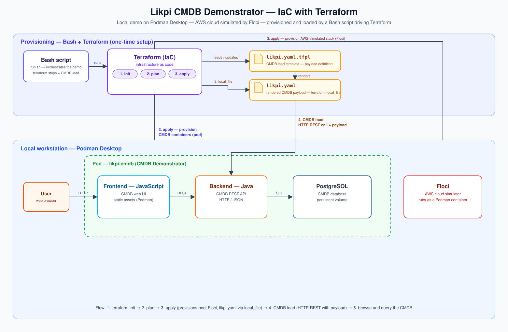

# Likpi CMDB - Enterprise IaC Deployments



Welcome to the Infrastructure as Code (IaC) deployment repository for the Likpi CMDB demonstrator. 
This repository provides a **local first demo** automation modules to test Likpi.

It uses
- Podman via Podman desktop,
- Likpi CMDB solution,
- a local Cloud simulator with Floci AWS mode,
- and Terraform IaC as first demo.

- Other integrations will be activated later: Ansible, Helm, OpenTofu.

## Repository Structure
* **/.github/workflows:** GitHub Actions pipelines for strict Pre-Merge YAML validation against the Likpi Gatekeeper schema.
* **/ansible:** Playbooks for Day 1 bare-metal/VM provisioning, including Java 17, Nginx, and systemd service registration.
* **/helm:** Kubernetes charts to orchestrate Likpi across Docker containers with StatefulSets for PostgreSQL.
* **/sim-cloud-floci-podman:** Local Cloud simulator based on Floci with floci-podman integration
* **/terraform:** AWS modules to provision cloud infrastructure and dynamically template GitOps-compliant `likpi.yaml` manifests.

## Quick Start
1. Install Podman Desktop - https://podman-desktop.io/
2. Download and install Likpi CMDB https://www.likpi.com : Frontend / Backend / Database PostgreSQL with Docker compose script in Podman
* 2.1 http://localhost:9096/
* 2.2 http://localhost:9096/api/v1/schema/json-schema

3. Install ./sim-cloud-floci-podman/floci-podman.sh
* 3.1 Launch Podman: 'podman machine start'
* 3.2 Install Floci via floci-podman: 'chmod u+x ./install_floci_podman.zsh'
* 3.3 Launch Floci: 'cd ./sim-cloud-floci-podman/floci-podman-0.1.1/bin && ./'

```bash
podman volume create floci-data
sh
export FLOCI_PODMAN_SOCK=$(podman machine inspect podman-machine-default | jq -r '.[0].ConnectionInfo.PodmanSocket.Path')
MY_PWD=$(pwd)
ROOT="$(pwd)/sim-cloud-floci-podman/floci-podman-0.1.1/"
alias fp="${MY_PWD}/sim-cloud-floci-podman/floci-podman-0.1.1/bin/floci-podman"
fp up aws
fp check

--
ALTERNATIVE:

podman machine ssh "sudo systemctl enable --now podman.socket && sudo sed -i 's|unix:///run/podman/podman.sock|unix:///run/podman/podman.sock tcp://0.0.0.0:2375|g' /usr/lib/systemd/system/podman.socket && sudo systemctl daemon-reload && sudo systemctl restart podman.socket"

podman volume create floci-data
MY_PWD=$(pwd)
SOCKET=$(podman machine inspect podman-machine-default | jq -r '.[0].ConnectionInfo.PodmanSocket.Path')
podman run -d --name floci \
  --privileged \
  -p 127.0.0.1:4566:4566 \
  -v "${MY_PWD}/sim-cloud-floci-podman/floci-data:/app/data:Z" \
  -v "$SOCKET:/var/run/docker.sock:z" \
  -e FLOCI_STORAGE_MODE=persistent \
  -e FLOCI_STORAGE_PERSISTENT_PATH=/app/data \
  -e FLOCI_RUNTIME_API_HOST=0.0.0.0 \
  -e DISABLE_WEB_UI=1 \
  -e DOCKER_CMD=podman \
  --security-opt label=disable \
  floci/floci:latest

./sim-cloud-floci-podman/floci-podman-0.1.1/bin/floci-podman up aws
```

Expected result: AWS — floci on port 4566 - http://localhost:4566/ http://localhost:4566/_floci/ui ( console/aws )  http://localhost:4566/_floci/ui/status

podman rm -f floci

4. Install Terraform - https://developer.hashicorp.com/terraform/install

On MacOs:
```bash
brew tap hashicorp/tap
brew install hashicorp/tap/terraform
terraform -version
```

5. Test the Terraform IaC pipeline with Bash script

```bash
cd ./terraform
chmod u+x 0_start_tf_pipeline.sh
./0_start_tf_pipeline.sh
```

## Stop
```bash
./sim-cloud-floci-podman/floci-podman-0.1.1/bin/floci-podman down aws
podman machine stop
```
## Restart
```bash
podman machine start
podman restart \
  --filter name='^(cmdb-postgres|cmdb-backend|cmdb-frontend|floci)$' \
  --filter status=exited
sleep 5
podman ps --all \
  --filter name='^(cmdb-postgres|cmdb-backend|cmdb-frontend|floci)$' \
  --format "table {{.Names}}\t{{.Status}}\t{{.State}}\t{{.ExitCode}}"

podman logs --tail=100 cmdb-postgres
podman logs --tail=100 cmdb-backend
podman logs --tail=100 cmdb-frontend
podman logs --tail=100 floci
```

## Network allowlist
### Installations
* www.likpi.com
* doc.likpi.com
* fonts.gstatic.com - Google
* n8n.webessentiel.fr - Likpi download
* hub.docker.com - Likpi container images
* github.com
* pypi.org - 'python3 -m pip install PyYAML==6.0.3 jsonschema==4.26.0' OR 'uv pip install PyYAML==6.0.3 jsonschema==4.26.0' (uv python install 3.14 ; uv venv 3.14 ; source .venv/bin/activate)

### Updates
* registry.podman-desktop.io - Podman desktop updates
* hub.docker.com - Container images
* ec2.us-east-1.amazonaws.com Terraform provider

## Open source projects used
* IBM/Red Hat - Podman Desktop - https://podman-desktop.io/
* Floci - https://floci.io/ https://github.com/floci-io/floci
 * + https://github.com/DawidAdamski/floci-podman/
* IBM Terraform - https://developer.hashicorp.com/terraform/install
* Bash and Python for ./terraform/0_start_tf_pipeline.sh 
